  

 

  
  
  
  

 

---

## 🧠 About

SOC Analyst focused on **threat detection, DFIR, and threat intelligence**.  
I build tools, hunt threats, and work toward a career in cybercrime investigation.  
Everything in this profile is something I actually built or broke.

---

## 🛠️ Projects

| Project | Description |
|---|---|
| **[Pcap_Whisperer](link)** | Snort-powered PCAP scanner · auto rule download · color-coded malicious/clean verdict |
| **[IOC Hunter](link)** | Telegram-based enrichment pipeline · VirusTotal · OTX · MalwareBazaar · URLScan · 4-tier verdict system |
| **[DNS Tunnel Detector](link)** | Shannon entropy scoring · IOC flagging · risk classification |
| **[Global Threat Map](link)** | Animated attack arcs · real-time MITRE ATT&CK labels |
| **[Pcap Crawler](link)** | PCAP forensics automation |
| **[WFP Forensic Script](link)** | Windows Filtering Platform extraction |
| **[WannaCry Analysis](link)** | Static + dynamic · kill switch bypass in IDA Pro · custom YARA rule |

---

## ⚙️ Stack

**SIEM & Platforms**  
`Splunk` `ELK` `Microsoft Defender` `SentinelOne` `Cynet`

**Threat Intel & Malware**  
`MISP` `OpenCTI` `IDA Pro` `Volatility` `YARA` `VirusTotal` `MalwareBazaar`

**Automation & Scripting**  
`Python` `n8n` `Bash`

**Environment**  
`Kali Linux` `Active Directory` `Wireshark` `Snort`

---

## 📊 Stats

  
  

---

## 🎓 Certifications

- 🏅 CRDFA — Cyber Readiness & Digital Forensics Analysis
- 🏅 Israeli National Cyber Directorate (מערך הסייבר הלאומי) Graduate  
- 🏅 Certificate of Excellence — John Bryce

---

  Threat hunter in progress · building in public · open to collaborate

